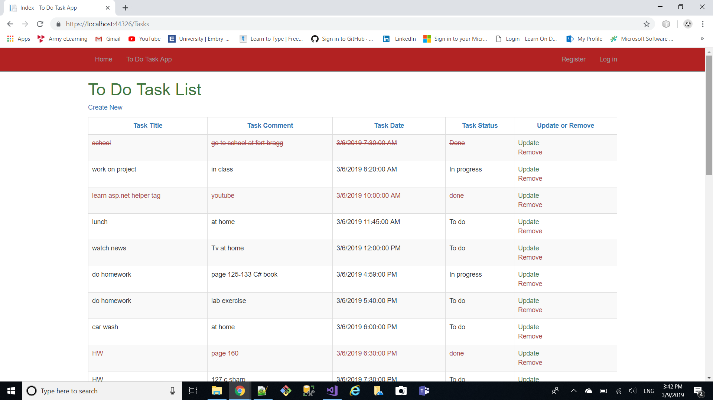

# ToDoTaskApp

## This is a time management ASP.NET MVC CORE Web application.

### This application let users create a new task to do in the future.
### To create a new task the user will enter the task title, the task comment,
### the task date, and the task status in the form and click save.
### All user's tasks are saved in the database.
### The user are able to change the status of the task into "in progress" or "done"
### When the user change the status of a task to done, the task will be strikeout 
### and change the color of the task to red.
### The user will be able to create, read, update, and delete a task.
### The user will be able to display all the list of the tasks to do, in progress, and completed.

# Techonologies used to build this web application:

## 1. ASP.NET MVC CORE
## 2. C#
## 3. HTML5
## 4. CSS3
## 5. BOOTSTRAP
## 6. MICROSOFT SQL SERVER
## 7. ENTITY FRAMEWORK
## 8. VISUAL STUDIO 2017

# User Interface look and feel!

